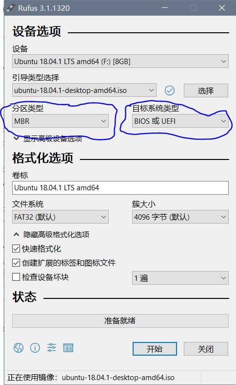

## 安装Windows系统和Linux系统

双系统安装要先安装windows，然后安装Linux，Linux使用的grub引导支持多系统引导。如果你觉得这篇内容不够详细，可以再去网上搜索其他内容参考。但是有一点，不建议使用老毛桃，软碟通（UltraISO）制作启动盘。

Windows平台启动盘制作工具：Rufus。

如果你只是想安装双系统，直接看后面的[安装Linux与Windows共存]一节。

### 如何安装Windows系统

这里只给出Win10的安装过程，Win7安装过程类似。

**先给出第一种安装方式，也是最简单的方式：**

如果你不需要重新分区，可以把系统镜像解压到一个非系统盘的分区中，然后运行解压目录中的setup.exe。然后会自动进入系统安装过程。之后的操作按照提示执行。

**U盘安装系统**

首先要确定你的启动模式，BIOS或UEFI，现在所是说的BIOS基本上都已被UEFI取代，但是UEFI也提供了兼容模式：Legacy。

开机马上按F2可以进入UEFI界面，在Boot选项里可以看到启动模式：

* Legacy
* UEFI

**现在对BIOS和UEFI做简单说明：**

Legacy是早期的BIOS模式，简单来说BIOS模式功能有限，UEFI功能更强，UEFI和BIOS是不同的东西，但是UEFI规范要求保持对BIOS模式的兼容。早期的BIOS支持MBR分区方式是使用硬盘第一个扇区的64字节，每个分区16字节，所以主分区最多是4个。最开始的446字节用于存储引导程序，最后两个字节55AA标记可引导。否则，即使有引导程序也无法引导系统。MBR模式无法支持超过2T容量的硬盘。MBR的缺点是：引导程序大小不确定，而446字节限制对很多方案是不够用的，所以很多系统都采用了分步引导，并且分区方式也不够灵活。

UEFI和GPT分区联系非常紧密，这里仅仅简单说明，UEFI规范说明了实现UEFI固件程序时必须能识别FAT以及FAT变种的文件系统。并规范了一种可执行文件格式：efi。GPT分区中的EFI分区用于存储引导程序，如果你解压Ubuntu的系统镜像会发现其中有一个EFI目录包括了.efi格式的文件，这是放在EFI分区的启动程序。


现在的笔记本基本都是UEFI模式的，除非是重新安装系统时更改设定。这里推荐一个Windows平台的启动盘制作工具rufus。




插入U盘，运行软件会自动识别U盘，在选择镜像后注意选择分区类型和目标文件系统类型，要和UEFI的固件模式对应：

* MBR - BIOS

* GPT - UEFI

这个和UEFI固件的设定要对应：

* Legacy对应 MBR
* UEFI对应GPT

右边选项的BIOS或UEFI表示用于BIOS固件或是UEFI固件，因为UEFI支持BIOS模式。

通常按F2会进入UEFI界面，可以调整启动顺序，USB启动调整到最开始，然后重启会先启动U盘，往往在安装后还要设置回去，很麻烦。制作镜像后，重启系统，重启后，马上按F12，会进入快速启动选项。有些笔记本F9或者是其他按键，不确定的可以多试几个，比如F12，F9，F10，ESC。

选择刚才的U盘启动。安装过程按照提示进行。如果不重新分区，选中C盘，确定就可以直接安装。


### 安装Linux系统和Windows系统共存

按照微软的一贯作风，Windows是不会去兼容其他系统的。

安装Windows后可以安装Linux与Windows共存，此时是grub引导系统，会在引导项里加入Windows，而Windows不支持多系统引导。

同样要知道Windows是在哪种模式下安装的：Legacy/UEFI。然后使用rufus制作对应模式的启动盘。目前很多发行版都出现安装过程中断或是启动黑屏等问题，最新的系统启动程序有问题，目前来说，Ubuntu是没有问题的，16.04，18.04版本都可以。

启动盘制作好以后，重启F12进入快速启动（也可能是其他按键，可以查每个品牌型号的快速启动键），选择U盘启动，进入Linux安装界面，以Ubuntu为例，桌面环境可以选择中文简体，注意后面选择的键盘布局是：

**英语（美国）**，这个和语言无关，而是你的键盘按键布局是这种类型。

接下来的步骤会让你选择安装方式，选择[安装Ubuntu与Windows共存]，然后会让你选择分配空间大小，并弹出窗口，询问是否写入更改，选择确定。

接下来就是安装过程，按照提示去做，安装完成后，重启。

**注意**：如果你的笔记本或其他类型的设备是两块硬盘，多数情况是是一个固态硬盘，一个机械硬盘。双系统的安装最好要安装在一个盘上，系统安装在固态盘上启动快。如果是购买时就已经是两块硬盘，Windows系统已经安装在固态盘上，安装Linux时在调整分区大小时注意选择硬盘要选择已经安装Windows的，如果空间不够用只能选择另一块硬盘，但是这时候往往会出现冲突，两块硬盘都可以引导，


### 下载链接

Win10下载：

```
ed2k://|file|cn_windows_10_consumer_edition_version_1803_updated_aug_2018_x64_dvd_2cf38490.iso|5275461632|FAE1391E8F1EEAB7005AE66982FCD27B|/
```


Ubuntu18.04下载

http://releases.ubuntu.com/18.04/ubuntu-18.04.1-desktop-amd64.iso

